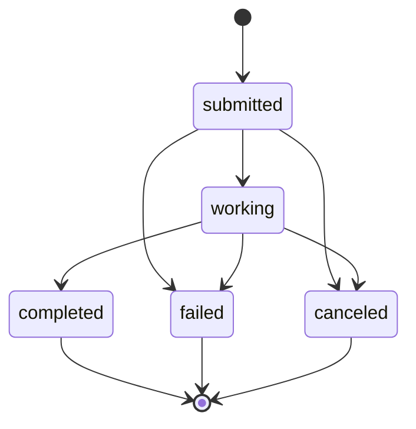

# A2A Tasks & JSON-RPC

KAOS implements the [A2A protocol](https://github.com/google/A2A) (RC v1.0) for agent-to-agent communication via JSON-RPC 2.0.

## Overview

The A2A subsystem provides:
- **TaskManager ABC** with `LocalTaskManager` (in-memory) and `NullTaskManager` (no-op) implementations
- **Synchronous task execution** — `SendMessage` returns a completed task
- **JSON-RPC 2.0 endpoint** at `POST /` with A2A spec-compliant methods
- **Task listing** — `ListTasks` returns all tasks retained by the current agent process
- **Agent card** discovery at `/.well-known/agent.json` with A2A capabilities
- **A2A-compliant delegation** — RemoteAgent uses `SendMessage` for inter-agent communication

The existing `/v1/chat/completions` endpoint is preserved for interactive/synchronous use.

## Module Organization

- `pais/a2a.py` — TaskManager ABC, LocalTaskManager, NullTaskManager, Task/TaskState data model, JSON-RPC models, dispatcher, method handlers, route setup
- `pais/serverutils.py` — RemoteAgent (A2A + chat completions delegation)

## Task States



## JSON-RPC Methods

### SendMessage

Submit a message for processing. Executes synchronously and returns a completed task.

```bash
curl -X POST http://agent:8000/ \
  -H "Content-Type: application/json" \
  -d '{
    "jsonrpc": "2.0",
    "method": "SendMessage",
    "id": 1,
    "params": {
      "message": {
        "role": "user",
        "parts": [{"type": "text", "text": "Analyze this data"}]
      },
      "contextId": "optional-session-id"
    }
  }'
```

Response:
```json
{
  "jsonrpc": "2.0",
  "id": 1,
  "result": {
    "id": "task-uuid",
    "sessionId": "session-uuid",
    "status": {"state": "completed", "message": "Done", "timestamp": "..."},
    "history": [
      {"role": "user", "parts": [{"type": "text", "text": "Analyze this data"}]},
      {"role": "agent", "parts": [{"type": "text", "text": "Analysis result..."}]}
    ]
  }
}
```

### GetTask

Retrieve task state. Returns current state, history, and output.

```bash
curl -X POST http://agent:8000/ \
  -H "Content-Type: application/json" \
  -d '{"jsonrpc": "2.0", "method": "GetTask", "id": 2, "params": {"id": "task-uuid"}}'
```

### ListTasks

Retrieve all tasks retained by the current agent process, including terminal tasks. Results are sorted newest-first by status timestamp. `LocalTaskManager` stores tasks in memory, so this list is ephemeral and does not survive pod restarts.

```bash
curl -X POST http://agent:8000/ \
  -H "Content-Type: application/json" \
  -d '{"jsonrpc": "2.0", "method": "ListTasks", "id": 3}'
```

Response:
```json
{
  "jsonrpc": "2.0",
  "id": 3,
  "result": {
    "tasks": [
      {
        "id": "task-uuid",
        "sessionId": "session-uuid",
        "status": {"state": "completed", "message": "Done", "timestamp": "..."},
        "history": [],
        "artifacts": [],
        "metadata": {},
        "events": [],
        "autonomous": false,
        "output": ""
      }
    ],
    "count": 1
  }
}
```

### CancelTask

Cancel a task. Returns the task in its current state. Since execution is synchronous, tasks are typically already completed.

```bash
curl -X POST http://agent:8000/ \
  -H "Content-Type: application/json" \
  -d '{"jsonrpc": "2.0", "method": "CancelTask", "id": 3, "params": {"id": "task-uuid"}}'
```

### Legacy Aliases

For backward compatibility, lowercase aliases are supported:
- `tasks/send` → `SendMessage`
- `tasks/get` → `GetTask`
- `tasks/list` → `ListTasks`
- `tasks/cancel` → `CancelTask`

## Error Codes

| Code | Name | Description |
|------|------|-------------|
| -32700 | Parse Error | Invalid JSON |
| -32600 | Invalid Request | Not a valid JSON-RPC request |
| -32601 | Method Not Found | Unknown method |
| -32602 | Invalid Params | Missing or invalid parameters |
| -32603 | Internal Error | Server error during processing |
| -32001 | Task Not Found | Task ID does not exist |

## TaskManager Backends

| Backend | Env Value | Description |
|---------|-----------|-------------|
| `LocalTaskManager` | `local` (default) | In-memory storage with synchronous execution and OTel |
| `NullTaskManager` | `null` | No-op, disables task lifecycle |

Configure via `TASK_STORE_TYPE` environment variable.

## Agent Card

When TaskManager is active (not NullTaskManager), the agent card reflects A2A capabilities:

```json
{
  "name": "my-agent",
  "protocolVersion": "0.3.0",
  "supportedProtocols": ["jsonrpc"],
  "capabilities": {
    "streaming": true,
    "pushNotifications": false,
    "stateTransitionHistory": true
  }
}
```

## Architecture

### TaskManager ABC

TaskManager ABC defines the interface: `send_message()`, `list_tasks()`, `get_task()`, `cancel_task()`, `wait_for_completion()`, `shutdown()`.

- **LocalTaskManager**: In-memory dict storage, synchronous process_fn execution, OTel instrumentation
- **NullTaskManager**: No-op implementation (like NullMemory)

### Task Execution Flow

1. `SendMessage` → `TaskManager.send_message()` creates task, executes process_fn inline
2. Task transitions: submitted → working → completed/failed
3. Completed task returned immediately to caller
4. `ListTasks` → retrieves all retained tasks, newest-first
5. `GetTask` → retrieves stored task
6. `CancelTask` → no-op for completed tasks (synchronous execution)

### A2A Delegation

RemoteAgent delegates to sub-agents using A2A `SendMessage` when the remote agent supports it:
1. Agent card is fetched from `/.well-known/agent.json`
2. If `supportedProtocols` includes `"jsonrpc"`, use A2A `SendMessage`
3. Falls back to `/v1/chat/completions` if A2A is unavailable or fails
4. Response extracted from: artifacts → output → history (last agent message)

### Observability

TaskManager is instrumented with OpenTelemetry:
- Spans: `kaos.task.submit`, `kaos.task.execute`, `kaos.task.cancel`
- Metrics: `kaos.tasks` counter (by state), `kaos.task.duration` histogram
- No-op when OTel not initialized
